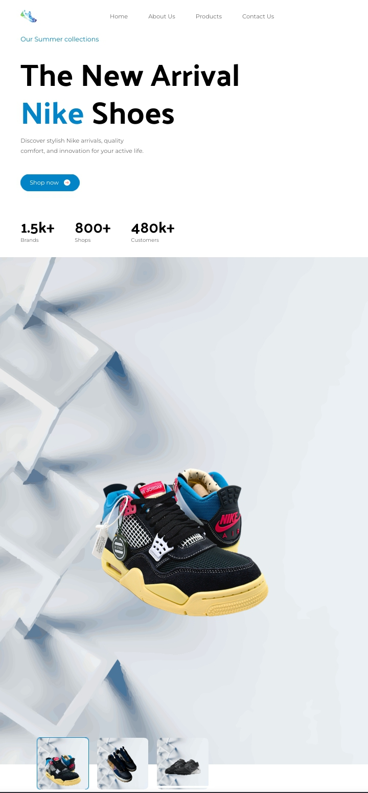

---

# Nike Landing Page with React, Vite, and Tailwind CSS

Welcome to the Nike Landing Page project built using React, Vite, and styled with Tailwind CSS! This project represents a simplified version of a landing page for Nike, showcasing their latest products and brand essence.

## Preview



## Features

- **Product Showcase**: Discover the latest Nike products.
- **Brand Story**: Learn about Nike's mission and values.
- **Responsive Design**: Optimized for various screen sizes.

## Technologies Used

- **React**: JavaScript library for building user interfaces.
- **Vite**: Fast build tool for modern web development.
- **Tailwind CSS**: Utility-first CSS framework for styling.

## Getting Started

1. Clone this repository:

   ```bash
   git clone https://github.com/Psamcyite/nike.git
   ```

2. Navigate to the project directory:

   ```bash
   cd nike
   ```

3. Install dependencies:

   ```bash
   npm install
   ```

4. Start the development server:

   ```bash
   npm run dev
   ```

5. Open your browser and navigate to [http://localhost:5173](http://localhost:5173).

## Directory Structure

```
nike/
│
├── src/            # React components and assets
│   ├── components/ # Reusable React components
│   ├── sections/   # Top-level React components representing pages
│   ├── constants/  # To manage static data used throughout the application
│   └── App.jsx     # Main application component
│
├── public/         # Public assets
│   └── index.html  # Main HTML file
│
└── README.md       # Project README
```

## Contributing

Contributions are welcome! If you have suggestions or want to improve this landing page, please fork the repository and submit a pull request.

## License

This project is licensed under the MIT License - see the [LICENSE](LICENSE) file for details.

## Acknowledgments

- [Tailwind CSS](https://tailwindcss.com/) for styling.

---

- Happy Coding!!!
